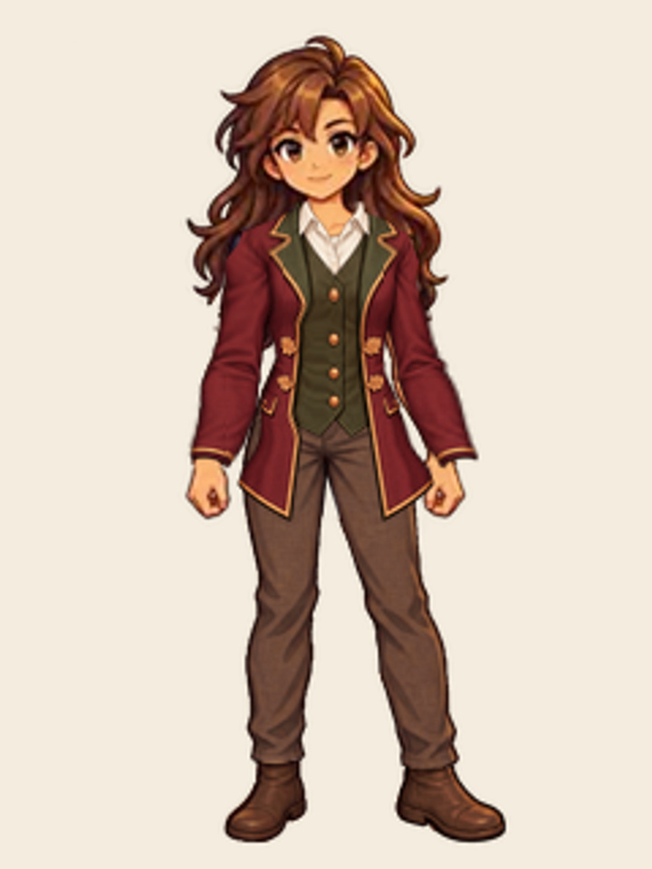
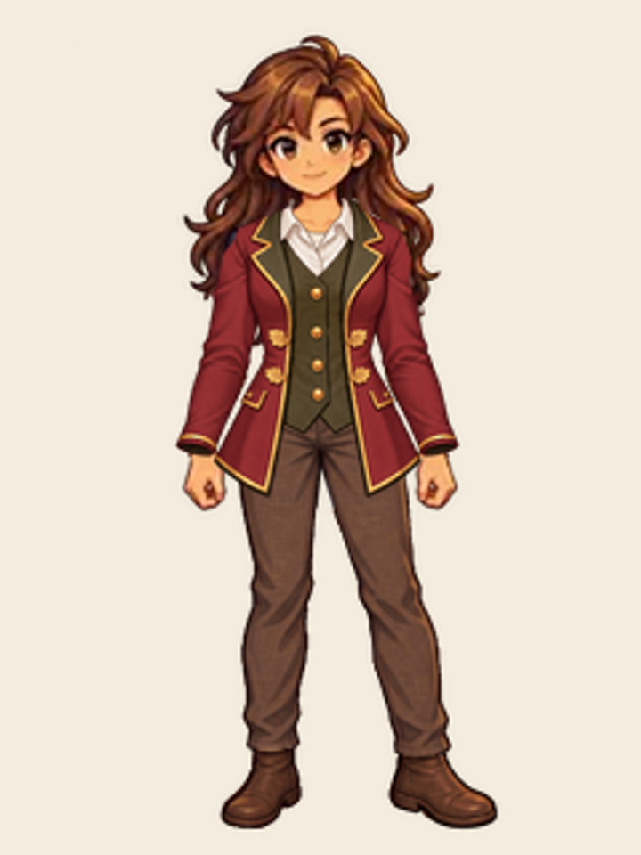

# Female Midnight Harvest Coat — size and sleeve correction

Status: **QA**. Independent exported-fit review passed; development CI and delivered runtime verification are pending. This is a repair candidate, not a new founder lock.

Tanya rejected the legacy fit claims on 2026-10-04 (America/Chicago): the sleeves and overall size were wrong. Work now proceeds one garment on one body at a time: female Harvest Coat first, then neutral and male coats; the cloak and mantle require their own separate fittings. Earlier blanket visual PASS statements are superseded. The historical neckline fix and its technical evidence remain valid for that narrow scope.

## Female-only correction

The new `harvest_coat_female_v4.webp` preserves the burgundy coat, olive waistcoat, ivory shirt, copper-gold piping, four leaf ornaments and pockets. The sleeves taper to the actual wrists, the torso and tails fit the fixed proportions, and connected sleeve contours cover both arms without hiding or replacing the body. The whole source is uniformly normalized once and placed on the 240 × 320 canvas. No per-piece/runtime transform or sleeve warp is used.

Female body v1, its identity, approved Everyday/robe/Woodland files, all male/neutral garments and the neckline renderer remain unchanged. Shared asset selection changes only the female Harvest Coat to v4. All other bodies retain their current v3 coat pending their own fit corrections. Catalog, eligibility, ownership, prices, equipment policy and persistence code are unchanged.

## Review and reproducibility

Five built-in ImageGen iterations were evaluated. The first still flared at the cuffs; later candidates exposed the left outer arm or right inner elbow. Those defects were repaired in connected garment contours before acceptance by the independent reviewer. The selected fifth source passes native and enlarged light/dark review for this female-only stage: natural shoulder/elbow volume, slimmer sleeves, fitted cuffs, intact hands/thumbs, balanced shorter tails and consistent ornament.

Reproduce with `NODE_PATH=<installed sharp modules> node tool/export_harvest_female_v4.cjs`. The script verifies locked female input hashes before exporting. Prompts, source, registration and output hashes are in `tool/art_assets/harvest_female_v4/`. The candidate asset is included in the integrity manifest.

Regression coverage checks the actual locked arm cross-sections and maximum cuff width, plus existing all-class equip/removal and same-body restoration. A focused female review uses the shared renderer and retains class switching and garment removal:

https://funszdidiot.github.io/questwell-app/?review=legacy-wardrobe&body=female&garment=midnight-harvest-coat

## Delivery limits

Export QA does not establish runtime completion, founder approval or completion of the other fits. Real-account persistence and native Safari/device testing are not claimed. Runtime evidence will identify the exact delivered revision and checks after deployment.
