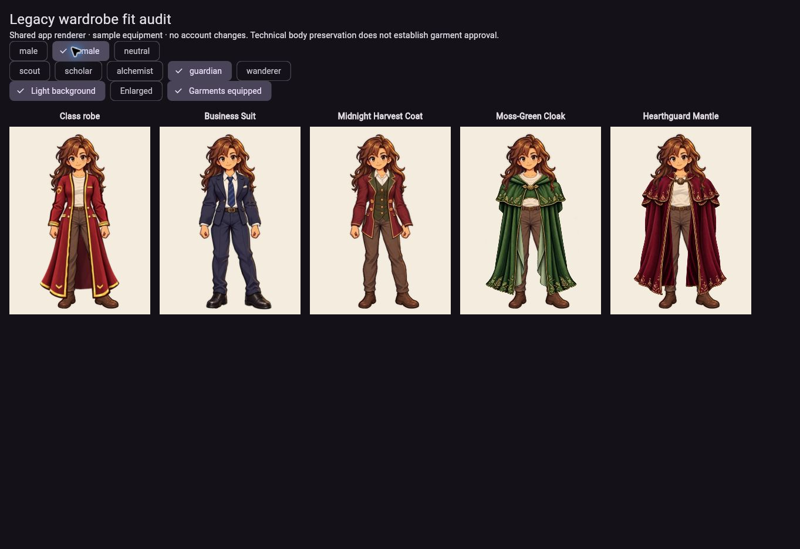
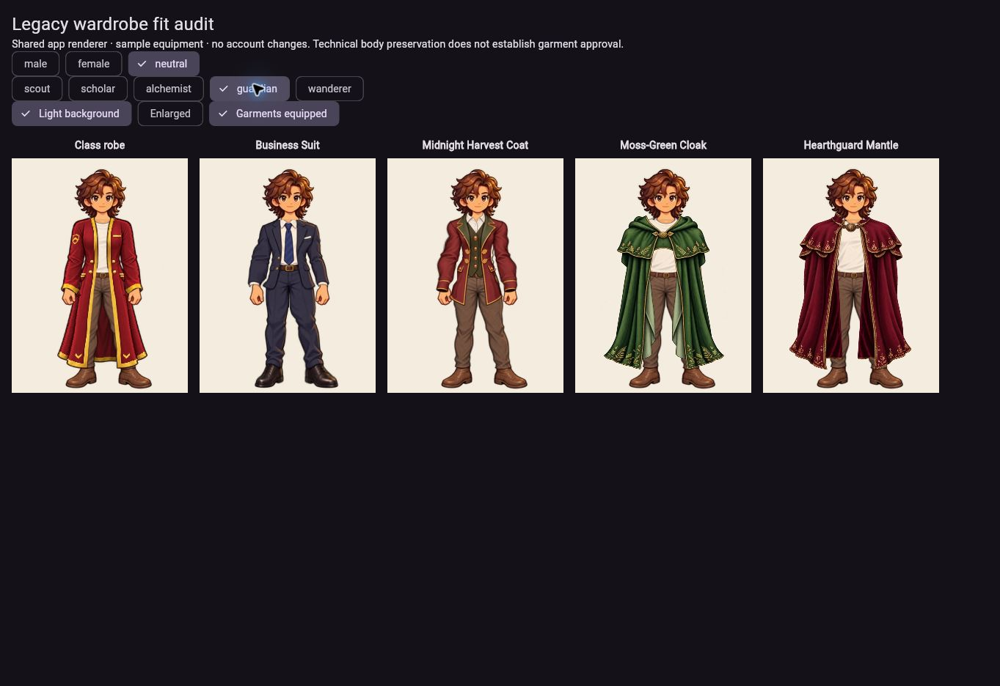
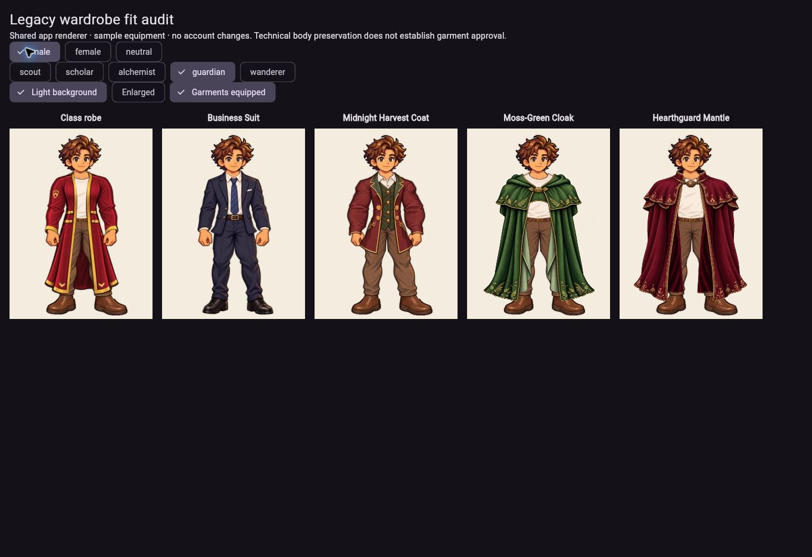

# Legacy fit repair — 2026-10-04 America/Chicago

Status: **DEV DEPLOYED**, verified `339cc4955bf944bdc42c025fd91cebfd84d16d92`, workflow `37260882702`. Scoped visual repair; no new founder lock.

Scope: Business Suit, Midnight Harvest Coat, Moss-Green Cloak and Hearthguard Mantle on locked male v3, female v1 and neutral v4. User explicitly requested female and neutral checks.

The deployed audit at 7533e3b exposed suit shoulder/foot leaks, a neutral inner-leg gap, Harvest shoulder/arm leakage and cloak exposed arms. New garment-only suit v1 and coat v3 overlays preserve each historical design. Cloaks reuse exact existing artwork with whole-drape registration. No body, identity, approved Everyday, robe, Woodland, grimoire or account-policy file changes.

Independent reviewer legacy_suit_visual_qa passed all six suit light/dark composites and all six final coat composites. Female shoulder/armpit and neutral upper-arm/forearm/cuff leaks were corrected, and female leaf motif distortion was resolved before PASS. Cloak/mantle trials pass arm coverage and ornament/drape checks; actual runtime foreground-neck restoration was subsequently corrected and verified below. Exact reviewed hashes, inputs and prompt briefs are in tool/art_assets/legacy_refit_v1/provenance.json. Built-in image generation supplied garment-only sources; reproducible Node/sharp exporters perform continuous registration and light/dark composites.

The renderer uses body → unified suit → original identity, with no old suit anatomy. Harvest uses the full body plus garment-only Everyday lower coverage and the coat. Regression coverage includes all classes/bodies, equipment restoration, held-item/cloak policy, no body ClipPath, retired Pathfinder exclusion and garment pixel checks. CI and runtime results are recorded below. No real account writes or new template approval is inferred.

## Delivered verification

Both repair revisions passed 387 Flutter tests, 8 Node tests, locked asset verification, static analysis, release web build and deployment: `588994dc` / workflow `37260274975`, then `339cc495` / workflow `37260882702`. The second revision corrects the historical generic cloak head crop and restores each original complete identity plus a body-specific neck contour. This fixed the neutral mantle band discovered in the enlarged actual app. No raster/body files changed in that correction.

At `588994dc`, 21 delivered asset hashes matched repository bytes (six new garments, six locked body/identity files, seven locked Everyday layers, two unchanged cloak assets); see `legacy-delivered-assets.json`. Final version stamp matched `339cc495`; its asset tree is unchanged. Both exporters reproduced every recorded export/composite hash exactly.

Actual shared renderer inspected all four legacy garments on male, female and neutral, light/dark native views and enlarged neutral suit/coat/cloak/mantle. Guardian class switching retained the same body, and removing garments restored the same neutral Guardian robe across all cards. Reload loaded the delivered correction. Independent final screenshot review found no blocking fit defect: intact suit/coat thumbs/hands, covered shoulders/forearms/feet, continuous mantle necklines and preserved face/hair. Exact screenshot hashes are in provenance.json.

Market sample inventory: female Business Suit owned → equipped → preview → unequipped retained ownership and 650 coins. Neutral Midnight Harvest Coat purchase charged exactly 180 sample coins (650 → 470), then equip → preview → unequip retained ownership and 470 coins. Body selector and catalog controls use existing eligibility/equipment policy. All-class/all-body restoration, closed-cloak held-item policy, satchel forearm layering, no primary-body clipping and retired Pathfinder behavior pass regression tests.

No database, model, catalog, eligibility, persistence or pricing code changed. Browser actions used in-memory fixtures; real-user login/refresh persistence was not retested. Prior deployed RPC migration evidence remains in MALE_ROBE_EVERYDAY_APP_INTEGRATION.md. This repair does not claim a new account rollout, new art approval or production promotion.

Runtime review: https://funszdidiot.github.io/questwell-app/?review=legacy-wardrobe

