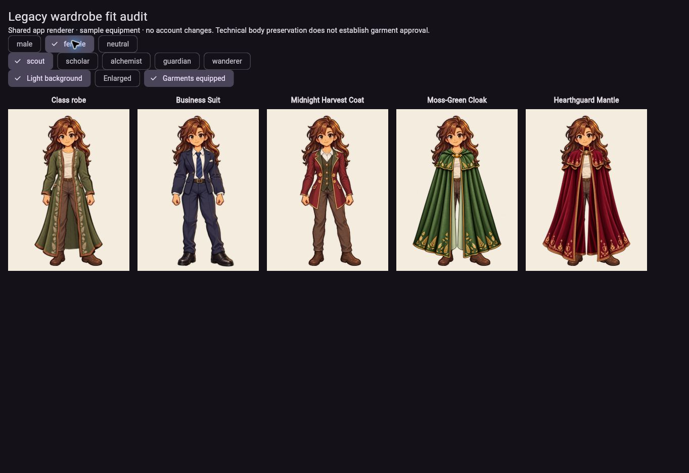
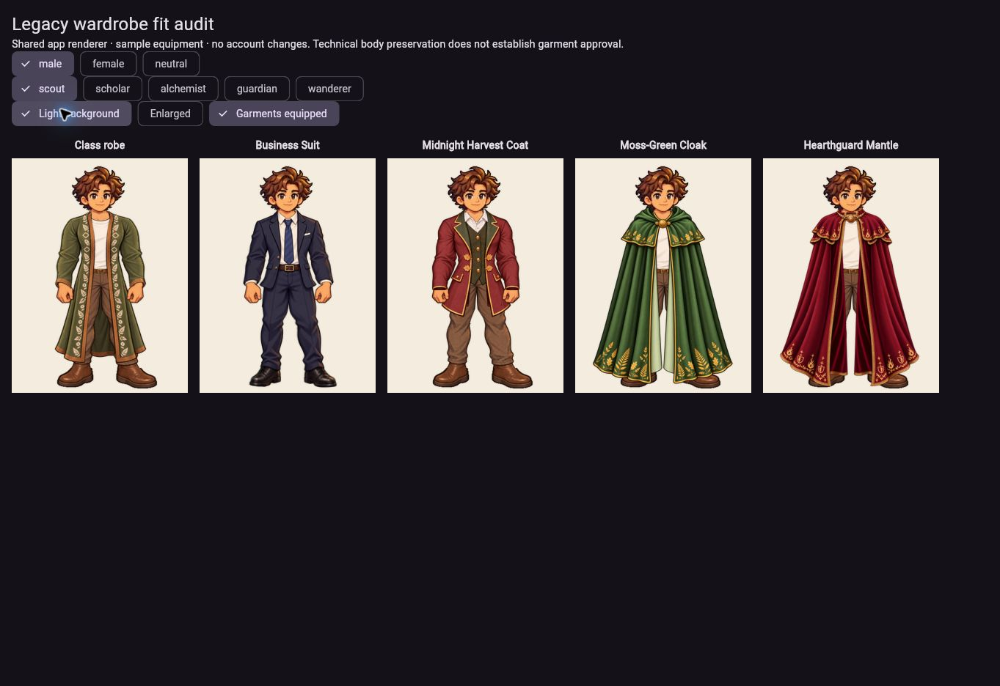
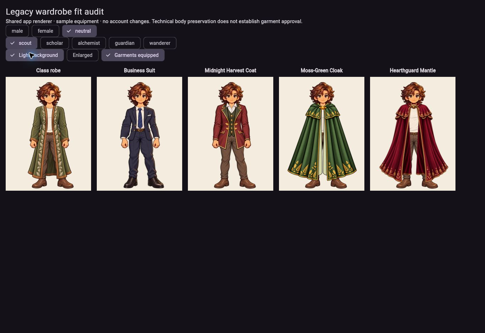

# Individual legacy garment refits — 2026-10-05

Status: **DEV DEPLOYED** at `0546cb4dbf188f0eb7c55298710d6f35765e50e1`. All nine fits passed independent source and delivered-runtime visual QA. No new founder lock.

Tanya rejected the earlier mantle/cloak/coat shapes despite their technical QA. She confirmed cloak and mantle conceal arms and hands; coat leaves hands exposed. Business Suit is outside this rejection.

## Construction and preservation

Each family/body uses a separately authored coherent garment. `tool/art_assets/legacy_refit_v2/fits.json` records exact selected sources, uniform registration, export/composite hashes and prompt set. `tool/export_legacy_refit_v2.cjs` reproduces the light/dark native and enlarged reviews. No local warps or runtime perspective transforms remain in these garments.

The shared renderer keeps each complete locked body and approved Everyday foundation at its original registration. Cloak/mantle use one full-canvas overlay per body. Coat uses one coherent overlay, followed by an unchanged-position duplicate of the original hands to put the coat side panels behind them. The primary body is never clipped. Neutral foreground identity restores original hair without repainting its rectangular neck tail over collars; the complete original neck remains below the garment.

Independent QA rejected intermediate skin rails, pinched waists, bulged cape sides, excessive flare and repeated lining flaps. Those findings were repaired through connected garment revisions. Final nine fits pass native/enlarged light/dark review for natural contours, complete expected coverage, intact hands, collars and unwarped motifs. Exact review hashes are in the fit record. Source QA is distinct from founder approval and delivered-runtime QA.

## Technical checks

- Locked avatar/garment verifier passed all existing preservation checks.
- Eight Node regression tests passed.
- Added full-arm/hand cloth-coverage checks for all six closed garments, individual body asset selection and no runtime garment transforms.
- Coat checks retain original head/leg/open-front behavior, class replacement/restoration and exact original hand depth.
- Catalog, body eligibility, class policy, ownership, prices and equipment availability are unchanged. Pathfinder remains retired; belt grimoire behavior is preserved.
- Workflow `37266712857` passed 385 Flutter tests, 8 Node tests, asset and seasonal checks, configured analysis, release build and development deployment. Analysis reports 45 nonfatal findings.
- Served version and browser-loaded bundle match `0546cb4`; all 15 delivered garment/body/identity hashes match.
- Actual browser review passed all nine fits on light/dark backgrounds, enlarged female coat/cloak/mantle, Guardian class switching and same-body class-robe restoration for all three bodies. Independent delivered visual review passed.
- Sample Market verified female mantle Scholar restriction → Guardian eligibility → purchase for 160 sample coins → equip → rendered preview → unequip. Male Harvest Coat remains available to every class at 180 coins and renders its individual fit through the catalog preview.
- Browser inventory is in-memory. No real-account writes or new real-user login/refresh persistence test were performed; existing persistence/policy code is unchanged. Native Safari/device testing was not repeated.
- Exact hashes, screenshots and scope are recorded in `tool/qa/individual_refit_delivery_0546cb4.json`.

Historical `LEGACY_FIT_REPAIR.md` evidence remains intact. Its successful deployment does not override Tanya's rejection of those garment shapes.

