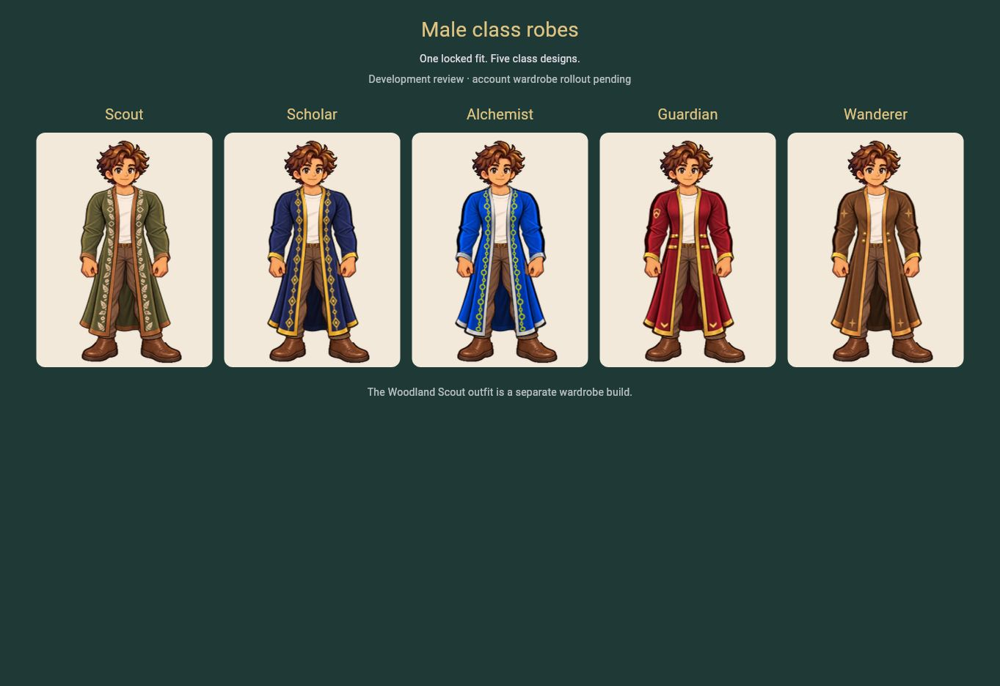
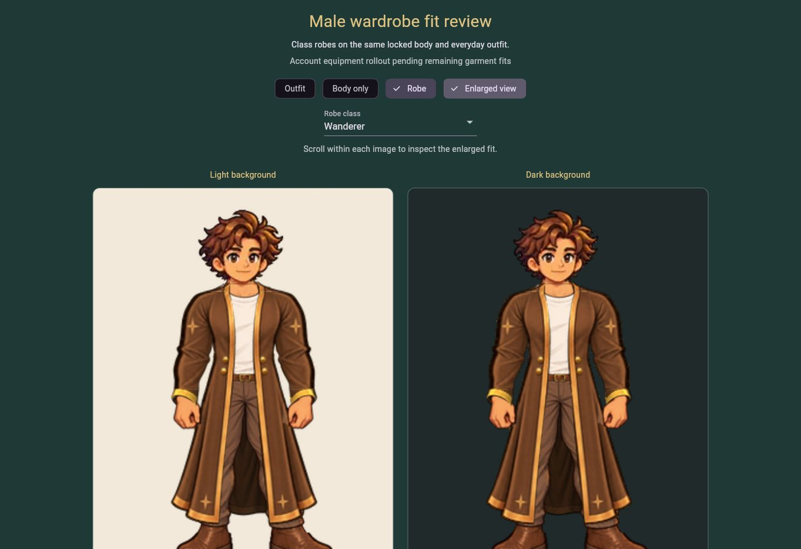

# Male class robes and thumb-gap repair — integration evidence

## Scope and authority

Tanya requested closure of the holes beside the thumbs on 2026-10-04 (America/Chicago). Implementation `7cc90309c1b97be5ea9ccd6f8f02044014795e35` adds five versioned rear-lining assets and selects them in the isolated male paper-doll review. This changes only connected cloth behind the hands. It preserves the historical accepted male robe v3 assets/fit reference, all class front/collar/cuff assets and the founder-locked male body v3, identity and unified Everyday v2. It does not establish a new founder template lock.

Source repair and independent export QA: [`../art/MALE_ROBE_THUMB_REPAIR_V1.md`](../art/MALE_ROBE_THUMB_REPAIR_V1.md), `tool/male_robe_thumb_repair_reference.json` and `tool/qa/male_robe_thumb_repair_v1_export_review.json`. The reported inner-thumb coordinates and lower left hand seam now have opaque backing. Connected repair contours remain within x71–91 and x149–169, y179–203. Zero opaque body-hand pixels change; zero composite changes occur outside this region. The nearby x78/y196 outer edge retains normal antialiasing at 251/255.

## Technical gates

Local read-only checks passed: historical robe v3, original sixteen class exports, repaired five rear layers, composite reproduction, fixed-input preservation and the asset manifest. Required workflow `37181630492` passed 363 Flutter + 8 Node tests, asset integrity, analysis, web build and development deployment. The added bundled regression checks the actual thumb-hole coordinates, shared rear masks and every unrelated mask value. Existing all-class tests preserve the same body/identity and seven-layer order through class change, Body only, Outfit, Robe and fresh-route restoration at 320, 390 and 1363 logical pixels. Phone layout evidence is a widget test, not physical-device testing.

## Account and product boundaries

Only development review routes consume `QuestwellMalePaperDoll`; the account Adventurer renderer, catalog, equipment policy, cosmetic services and backend files are unchanged by this repair. The required full regression gate includes Market fit restrictions, neutral Everyday, unsupported male Everyday, review-only neutral Woodland, historical Pathfinder retirement/ownership, cosmetic sync and purchase recovery tests. No account/economy/eligibility expansion, price change, account write, backend migration or production launch is introduced.

Male account wardrobe rollout stays queued until the remaining accepted fits support a coherent same-body transition. Everyday account support remains female + neutral; Woodland Scout remains female-only. Local review class/enlargement controls are not account persistence: reload intentionally restores the class specified in the review URL and native size. Real-user login/account restoration has not been tested by this batch.

## Baseline and later founder defect

The initial five-class delivery `b62e4ae`, workflow `37179075947`, passed 362 Flutter + 8 Node tests, assets/analyzer/build/deployment and 23 delivered asset hashes. All five class choices, native Body only/Outfit/Robe placement (x413.5, y336, 240×320), enlargement and Guardian URL reload were observed in the browser. Tanya's later thumb-gap report supersedes the earlier visual PASS for that detail. The baseline screenshots are retained as historical evidence, not repaired-runtime proof.

## Repaired delivery

`questwell-version.json` confirmed `7cc90309c1b97be5ea9ccd6f8f02044014795e35`. All 28 delivered SHA-256 values matched: 23 current renderer files and five retained historical rear layers. Browser checks showed all five native robes; Wanderer → Scout selection rendered the repaired lining with the same body. Body only → Everyday → Robe, native/enlarged return and reload retained the same 240×320 placement at x413.5/y336. Reload restored the URL-requested Wanderer in native Robe mode, rather than persisting local Scout/enlargement choices. Both Wanderer and Scout enlarged light/dark images were inspected. No application console errors were captured; browser-extension metadata noise was excluded.

Independent delivered visual QA passed for all five native avatars and enlarged Wanderer light/dark views: thumb gaps and lower hand join are closed, hands/cuffs remain visible, continuous rear shading matches exports and intentional underarm spaces remain intact. Enlarged screenshots crop boot bottoms; the native gallery shows complete footwear. Evidence records are `tool/qa/male_robe_thumb_repair_v1_delivery.json` and `tool/qa/male_robe_thumb_repair_v1_delivered_review.json`. Production status: **DEV DEPLOYED**, not a new founder lock or account rollout.

