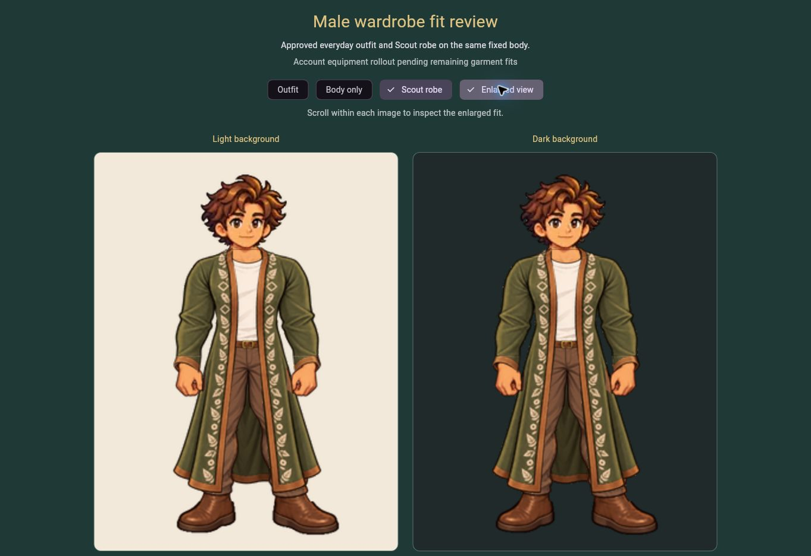

# Male robe v3 development integration

## Scope and authority

The exact accepted handoff is source commit `16facaf3b688b2d2f96e47bf2bd4a215685d0e6e`. Tanya directed “Make the cuff edges sharper and we’re good”. The source record verifies that condition and records independent visual QA. The earlier production dashboard described unfinished cuffs and is superseded by this newer handoff; this integration does not invent another founder approval.

The dedicated `?review=male-robe` route starts with the accepted Scout robe. The existing `?review=male-everyday` route still starts with Everyday. Both expose Body only, Outfit and Scout robe, with light/dark and enlarged views. These fixtures have no authentication, catalog purchase, equipment mutation or profile persistence dependency.

## Preservation and verification

- The unchanged male v3 body, identity and unified Everyday v2 outfit retain their canonical hashes.
- Runtime robe files are exact copies of the four accepted v3 source exports. The manifest pins both source and runtime files and the canonical fit/independent review records.
- `node tool/verify_male_robe.cjs` passes exact file, alpha, canvas, source, unchanged v2 geometry and full composite verification. The runtime order is rear → body → everyday → front → identity → collar → cuffs.
- `node tool/verify_male_everyday.cjs` passes unchanged foundation/outfit/source/composite checks. Asset-manifest verification and all eight Node tests pass locally.
- New regression coverage verifies bundle identity, three clothing states on the same body at 320/390/1200 px, enlargement and absence of body/layer fitting transforms or masks.
- Independent source/code review by `male_robe_integration_review` passed: complete hands, continuous cuff rims, natural straight hips, continuous rear drape and no detached seams/body leaks. This is separate from delivered-runtime inspection.

## Eligibility, equipment and persistence boundaries

This change extends the isolated fixed-body review widget only. It does not enable male Everyday or Woodland in account inventory/catalog, change default male class selection, alter prices/ownership, introduce an equipment policy or modify persistence. Existing eligibility/persistence regression suites still form part of the mandatory gate. No database migration or real-account write is required or performed. Account wardrobe rollout remains queued for a coherent same-body transition across the remaining accepted fits.

The Scout class robe is not the separate Woodland Scout outfit. Neutral Woodland remains an unaccepted candidate in QA, male Woodland remains queued, and female Woodland remains locked with existing female-only account support.

## Deployment evidence

Implementation revision: `31dfebe7e8907daf434de9cb95372bf9cce0706d`.
Required workflow: `37177492039`.
**DEV DEPLOYED — verified.** Workflow `37177492039` passed asset checks, analyzer, **355 Flutter tests**, **8 Node tests**, build and Pages deployment. The delivered `questwell-version.json` identifies the exact implementation revision; all seven delivered body/everyday/identity/robe asset hashes match.

Actual browser checks at `https://funszdidiot.github.io/questwell-app/?review=male-robe` passed:

- Initial Scout robe selection renders the complete accepted light/dark composites.
- Body only → Outfit → Scout robe keeps the same anatomy, identity and registration.
- Enlarged view works through keyboard Space and a direct pointer click after reload. A semantic automation click initially toggled back; the direct pointer and keyboard checks resolved the interaction uncertainty without changing the app.
- Reload restores the route’s Scout robe default on the same fixed foundation. Review controls are intentionally ephemeral; this does not claim account/session persistence testing.
- Independent delivered-image inspection by `male_robe_integration_review` passed: complete hands/thumbs, connected cuff edges, natural straight hips, continuous rear cloth, coherent collar and intact boots; no clipping, missing layer or registration drift.

Phone-width behavior was exercised in Flutter widget tests, not a physical mobile browser. Real-account login/refresh persistence was not exercised; no account behavior or database code changed in this scoped review integration.

Machine-readable delivery evidence: `tool/qa/male_robe_v3_delivery.json`.

