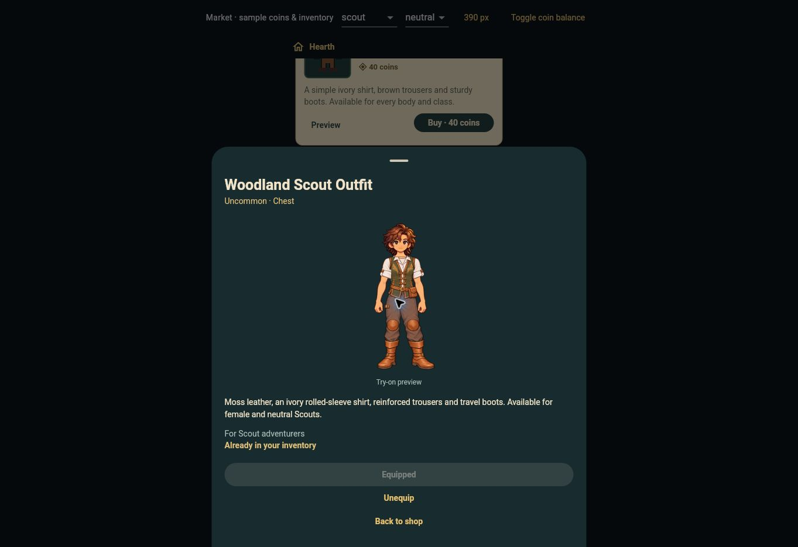

# Approved neutral outfit rollout

Tanya approved on 2026-10-04: “The neutral outfits are good- push them.”

Neutral Woodland v3 is LOCKED. Its exact single-overlay bytes, locked v4 body and identity are unchanged. Neutral Everyday v3 and the five neutral class robes retain their existing locks and integration. Canonical Woodland reference: `tool/neutral_woodland_fit_reference.json`.

App policy and catalog now support female and neutral Scouts. Male Woodland remains gated. Price 120, Scout class restriction, ownership and other item availability are unchanged.

## Verification

- Asset integrity verification passed; no artwork files changed.
- Migration `20261004212323_neutral_woodland_approved_rollout.sql` applied successfully.
- `tool/qa/neutral_woodland_rollout_check.sql` passed against the account backend: neutral first purchase, one-charge retry, equip/exclusivity, female-neutral equipment persistence, male rejection, class change removal, ownership retention, Everyday across every class/body, legacy availability, RLS and RPC ACLs. All synthetic mutations rolled back.
- Security advisors: zero findings.
- Shared-renderer, Market and inventory tests updated to assert neutral equipment eligibility and locked-body outfit rendering/restoration.
- **DEV DEPLOYED / art LOCKED** at `9ce9b92fce7221d3687c2c72248bc6546dfaae7b`; workflow `37236299144` passed 373 Flutter tests, 8 Node tests, analysis, asset checks, release build and deployment.
- Delivered version stamp and all ten active neutral asset hashes match (`tool/qa/neutral_woodland_v3/approved_delivery.json`).
- Actual 390px shared Market: neutral Scout purchase confirmation 120 coins, balance 650 → 530, ownership → equipped/In use, correct v3 try-on appearance with intact hands/body, then unequip → retained ownership. Shared renderer tests verify the neutral class robe stack returns when the chest is removed.
- Browser verification uses sample inventory; account persistence and authorization were tested through rolled-back public RPC fixtures. No private account login is claimed.

